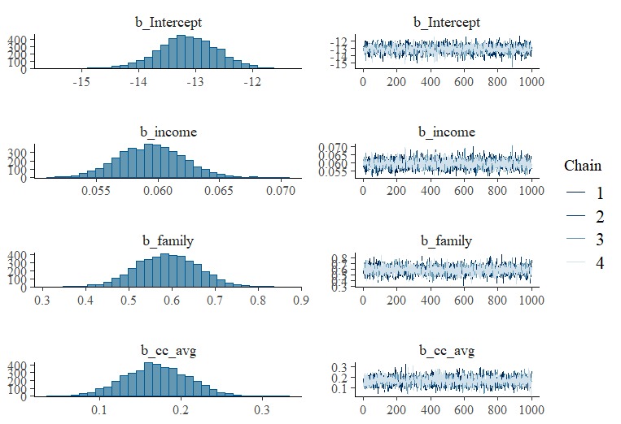

# Introduction

This project aims to identify which factors (predictors) influence the decision of a financial institution - like a bank - when granting a personal loan (variable of interest) to its clients. This kind of information can be used to optimize marketing campaigns, targeting specific demographics. To do so, a *Bayesian Logistic Regression Model* was implemented using the R package *"bmrs¨*. The analysis indicated this predictors as the most significant: *Educational Level (Graduate and Professional), family size and income*. The AUC (**0.949**) reveals the model has a great predictive capacity.

## Key Aspects of the Project

-   Bayesian Logistic Regression Model (with *brms* package)
-   Posterior Distribution and Odds Ratios Analysis and Interpretation
-   MCMC chains convergence diagnostics (**R-hat**, **Trace Plots**)
-   Model Performance Evaluation using ROC/AUC curve and Posterior Predictive Checks
-   Cleaning, pre process and data visualization

The bank wants to improve marketing campaigns efficiency when offering personal loans; instead of reaching out every single client in the data base (costly) it is needed a way to identify those clients with a higher probability of accepting a personal loan. The model seeks to create a profile of the *ideal client*, channeling the marketing efforts and increase returns.

# Data

Data set was retrieved from the *Kaggle* platform under the name: "[Bank Personal Loan Modelling](https://www.kaggle.com/datasets/itsmesunil/bank-loan-modelling)". It contains demographic and banking information of 5,000 clients.

## Pre process

-   The column names were standardized (easier manipulation)
-   Categorical variables were converted to factor type
-   *id* and *zip_code* variables were excluded as they are not relevant predictors.

```{r eval=TRUE, include=TRUE, echo=FALSE}
head(loan)
```

## EDA Visualizations

A brief EDA revealed a rather strong relation between the variables family size and educational level. As you can observe in the following graph, the distribution of graduates, professionals and clients with a *large* family size seems high.

```{r eval=TRUE, include=TRUE, echo=FALSE}
plot_1st
```

```{r eval=TRUE, include=TRUE, echo=FALSE}
plot_2nd
```

# Creating a Model

As the variable of interest (*personal_loan*) contains binary data a *logistic regression model* (for binary classification) was used. With limited information and wanting to incorporate prior knowledge, the Bayesian approach was selected. This helps us to provide a probability distribution to each model predictor and therefore extract more robust estimates of uncertainty.

## Priors and Diagnostics

To ensure model regularization and avoid over adjustment, *weakly informative priors* were used (*Normal(0, 2.5)*) for the coefficients (predictors). After adjusting the model the MCMC chains convergence was verified (*R_hat close to 1*) and the following trace graphs didn't show any odd pattern(s), we could secure the results reliability.




# Results

## Model Odd Ratios

```{r eval=TRUE, include=TRUE, echo=FALSE}
# Odd Ratio Conversion
loan_model %>% 
  gather_draws(b_Intercept, b_income, b_family, `b_education.*`, regex = TRUE) %>% 
  mutate(odds_ratio = exp(.value)) %>%
  reframe(
    median_or= median(odds_ratio),
    lower_ci = quantile(odds_ratio, 0.025),
    upper_ci = quantile(odds_ratio, 0.975)
  ) %>%
  distinct() %>% 
  gt() %>% 
  tab_header(title = "Model Odd Ratios Resume") %>% 
  fmt_number(columns = c(median_or, lower_ci, upper_ci), decimals = 2)
```

- Being graduated and professional increases the odds up to **50 times!** when accepting a personal loan.
- Having one more family member adds up to 80% in the odds also.
- Lastly, clients with relatively high income increases only 6% the odds of accepting a personal loan.

## Other Predictors Posterior Distributions

```{r eval=TRUE, include=TRUE, echo=FALSE}
ggplot(posterior, aes(x = b_cc_avg)) +
  stat_halfeye() +
  labs(title = "Posterior Distribution: Average Credit Card Expenditure (cc_avg)")
```

```{r eval=TRUE, include=TRUE, echo=FALSE}
ggplot(posterior, aes(x = b_mortgage)) +
  stat_halfeye() +
  labs(title = "Posterior Distribution: Mortgage")
```

```{r eval=TRUE, include=TRUE, echo=FALSE}
ggplot(posterior, aes(x = b_credit_cardYes)) +
  stat_halfeye() +
  labs(title = "Posterior Distribution: Has a Credit Card")
```

```{r eval=TRUE, include=TRUE, echo=FALSE}
ggplot(posterior, aes(x = b_onlineYes)) +
  stat_halfeye() +
  labs(title = "Posterior Distribution: Use online service")
```

# Model Evaluation

The predictive performance of the model was evaluated using the Receiver Operating Characteristic Curve (ROC) and the Area under that Curve (AUC). The value of **AUC = 0.9491** indicates a great discriminatory (clients who accept or don't) capacity.

```{r eval=TRUE, include=TRUE, echo=FALSE}
pROC::ggroc(roc_curve) +
  labs(
    title = "Loan Model ROC Curve",
    subtitle = paste("AUC:", round(auc_value, 3))
  ) +
  theme_minimal()
```

# Conclusions

The Bayesian approach to the Lineal Regression Model helped constructing a robust client profile (**highly educated, with "large" family and above average income**) with a high chance of accepting a personal loan. A bank's marketing department could use these kind of modeling results to segment its clients and focus future campaigns in order to increase potential investments returns.