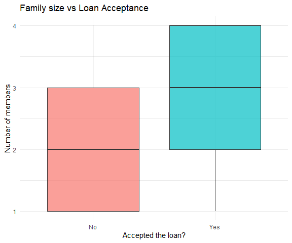
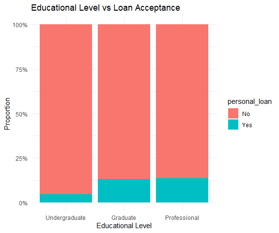
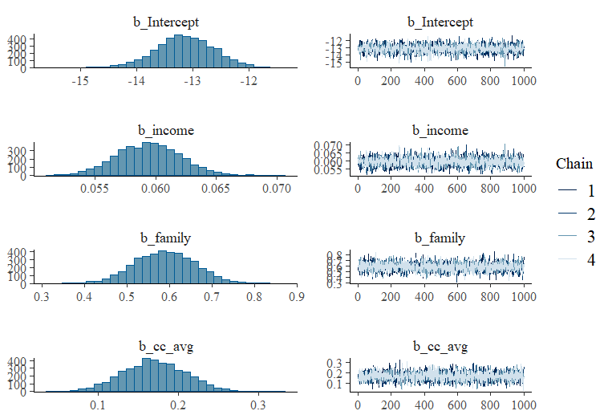
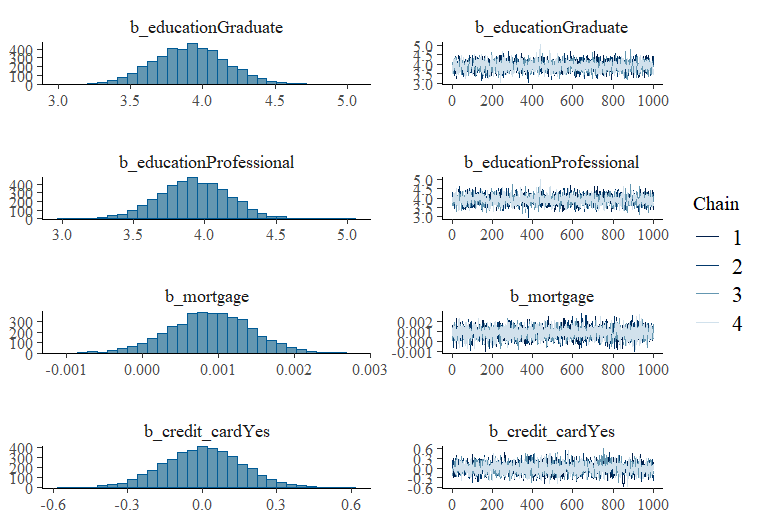
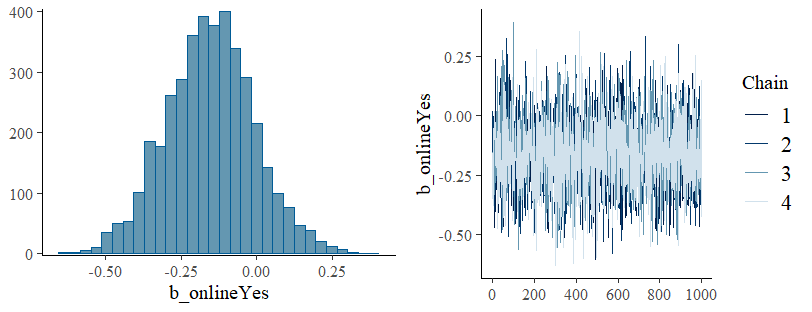
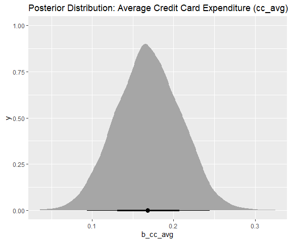
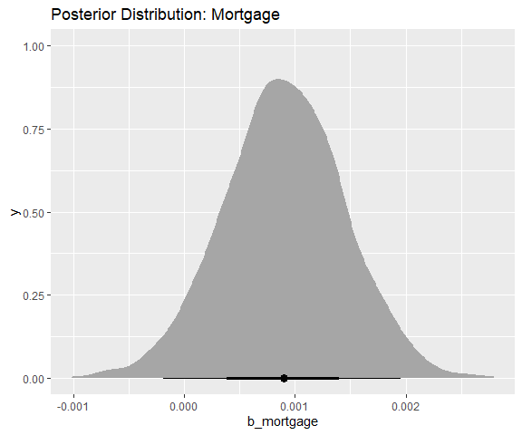
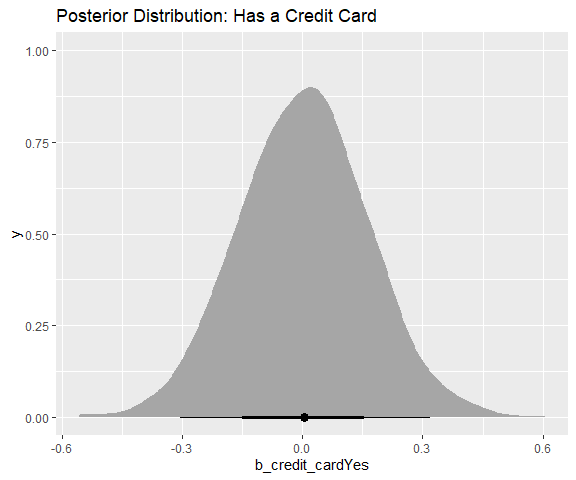
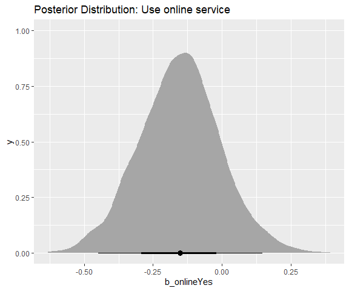
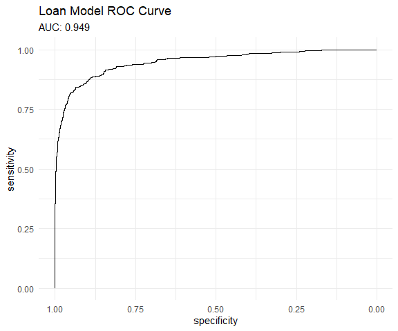

Personal Loan Acceptance - Bayesian Predictive Analysis
================
Juan José Alvarado

# Introduction

This project aims to identify which factors (predictors) influence the
decision of a financial institution - like a bank - when granting a
personal loan (variable of interest) to its clients. This kind of
information can be used to optimize marketing campaigns, targeting
specific demographics. To do so, a *Bayesian Logistic Regression Model*
was implemented using the R package *“bmrs¨*. The analysis indicated
this predictors as the most significant: *Educational Level (Graduate
and Professional), family size and income*. The AUC (**0.949**) reveals
the model has a great predictive capacity.

## Key Aspects of the Project

- Bayesian Logistic Regression Model (with *brms* package)
- Posterior Distribution and Odds Ratios Analysis and Interpretation
- MCMC chains convergence diagnostics (**R-hat**, **Trace Plots**)
- Model Performance Evaluation using ROC/AUC curve and Posterior
  Predictive Checks
- Cleaning, pre process and data visualization

The bank wants to improve marketing campaigns efficiency when offering
personal loans; instead of reaching out every single client in the data
base (costly) it is needed a way to identify those clients with a higher
probability of accepting a personal loan. The model seeks to create a
profile of the *ideal client*, channeling the marketing efforts and
increase returns.

# Data

Data set was retrieved from the *Kaggle* platform under the name: “[Bank
Personal Loan
Modelling](https://www.kaggle.com/datasets/itsmesunil/bank-loan-modelling)”.
It contains demographic and banking information of 5,000 clients.

## Pre process

- The column names were standardized (easier manipulation)
- Categorical variables were converted to factor type
- *id* and *zip_code* variables were excluded as they are not relevant
  predictors.

<!-- -->

    ## # A tibble: 6 × 12
    ##     age experience income family cc_avg education     mortgage personal_loan
    ##   <dbl>      <dbl>  <dbl>  <dbl>  <dbl> <fct>            <dbl> <fct>        
    ## 1    25          1     49      4    1.6 Undergraduate        0 No           
    ## 2    45         19     34      3    1.5 Undergraduate        0 No           
    ## 3    39         15     11      1    1   Undergraduate        0 No           
    ## 4    35          9    100      1    2.7 Graduate             0 No           
    ## 5    35          8     45      4    1   Graduate             0 No           
    ## 6    37         13     29      4    0.4 Graduate           155 No           
    ## # ℹ 4 more variables: securities_account <fct>, cd_account <fct>, online <fct>,
    ## #   credit_card <fct>

## EDA Visualizations

A brief EDA revealed a rather strong relation between the variables
family size and educational level. As you can observe in the following
graph, the distribution of graduates, professionals and clients with a
*large* family size seems high.

# Creating a Model

As the variable of interest (*personal_loan*) contains binary data a
*logistic regression model* (for binary classification) was used. With
limited information and wanting to incorporate prior knowledge, the
Bayesian approach was selected. This helps us to provide a probability
distribution to each model predictor and therefore extract more robust
estimates of uncertainty.

## Priors and Diagnostics

To ensure model regularization and avoid over adjustment, *weakly
informative priors* were used (*Normal(0, 2.5)*) for the coefficients
(predictors). After adjusting the model the MCMC chains convergence was
verified (*R_hat close to 1*) and the following trace graphs didn’t show
any odd pattern(s), we could secure the results reliability.

 

# Results

## Model Odd Ratios

<table class="gt_table" data-quarto-disable-processing="false" data-quarto-bootstrap="false">
  <thead>
    <tr class="gt_heading">
      <td colspan="4" class="gt_heading gt_title gt_font_normal gt_bottom_border" style>Model Odd Ratios Resume</td>
    </tr>
    &#10;    <tr class="gt_col_headings">
      <th class="gt_col_heading gt_columns_bottom_border gt_left" rowspan="1" colspan="1" scope="col" id="a.variable">.variable</th>
      <th class="gt_col_heading gt_columns_bottom_border gt_right" rowspan="1" colspan="1" scope="col" id="median_or">median_or</th>
      <th class="gt_col_heading gt_columns_bottom_border gt_right" rowspan="1" colspan="1" scope="col" id="lower_ci">lower_ci</th>
      <th class="gt_col_heading gt_columns_bottom_border gt_right" rowspan="1" colspan="1" scope="col" id="upper_ci">upper_ci</th>
    </tr>
  </thead>
  <tbody class="gt_table_body">
    <tr><td headers=".variable" class="gt_row gt_left">b_Intercept</td>
<td headers="median_or" class="gt_row gt_right">0.00</td>
<td headers="lower_ci" class="gt_row gt_right">0.00</td>
<td headers="upper_ci" class="gt_row gt_right">0.00</td></tr>
    <tr><td headers=".variable" class="gt_row gt_left">b_educationGraduate</td>
<td headers="median_or" class="gt_row gt_right">50.16</td>
<td headers="lower_ci" class="gt_row gt_right">30.89</td>
<td headers="upper_ci" class="gt_row gt_right">82.07</td></tr>
    <tr><td headers=".variable" class="gt_row gt_left">b_educationProfessional</td>
<td headers="median_or" class="gt_row gt_right">50.58</td>
<td headers="lower_ci" class="gt_row gt_right">31.61</td>
<td headers="upper_ci" class="gt_row gt_right">81.14</td></tr>
    <tr><td headers=".variable" class="gt_row gt_left">b_family</td>
<td headers="median_or" class="gt_row gt_right">1.80</td>
<td headers="lower_ci" class="gt_row gt_right">1.57</td>
<td headers="upper_ci" class="gt_row gt_right">2.08</td></tr>
    <tr><td headers=".variable" class="gt_row gt_left">b_income</td>
<td headers="median_or" class="gt_row gt_right">1.06</td>
<td headers="lower_ci" class="gt_row gt_right">1.06</td>
<td headers="upper_ci" class="gt_row gt_right">1.07</td></tr>
  </tbody>
  &#10;  
</table>

- Being graduated and professional increases the odds up to **50
  times!** when accepting a personal loan.
- Having one more family member adds up to 80% in the odds also.
- Lastly, clients with relatively high income increases only 6% the odds
  of accepting a personal loan.

## Other Predictors Posterior Distributions

# Model Evaluation

The predictive performance of the model was evaluated using the Receiver
Operating Characteristic Curve (ROC) and the Area under that Curve
(AUC). The value of **AUC = 0.9491** indicates a great discriminatory
(clients who accept or don’t) capacity.

# Conclusions

The Bayesian approach to the Lineal Regression Model helped constructing
a robust client profile (**highly educated, with “large” family and
above average income**) with a high chance of accepting a personal loan.
A bank’s marketing department could use these kind of modeling results
to segment its clients and focus future campaigns in order to increase
potential investments returns.
